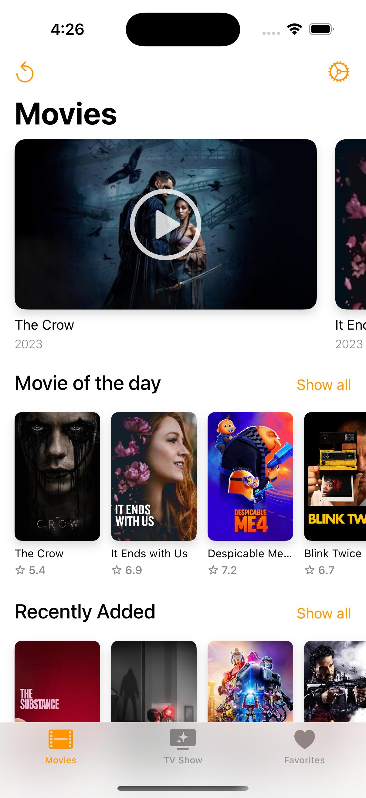
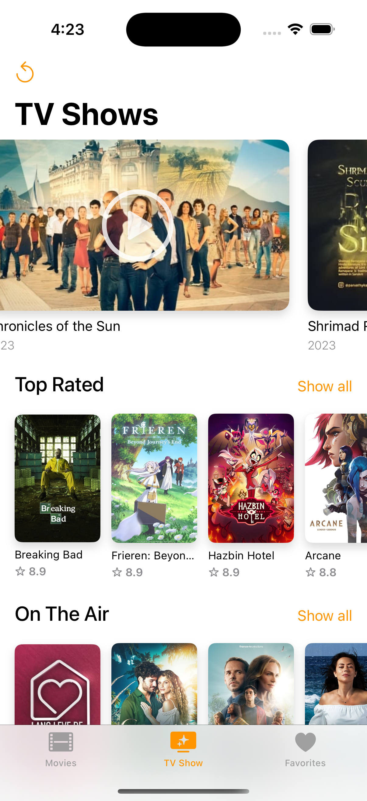
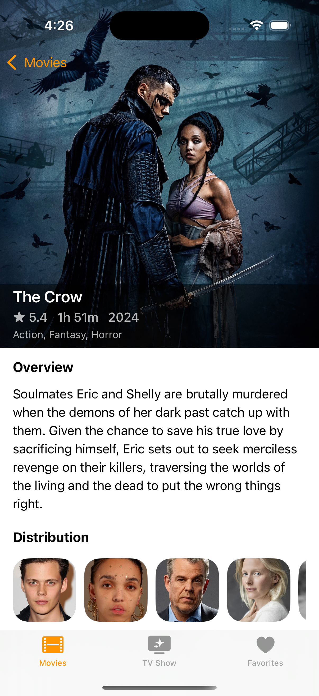

## MovieMap
SwiftUI, MVVM, Async/Await, Error Handling

- Include a JSON file and decode it for prototyping purposes.
- Implement an APIService with Async/Await for efficient error handling.
- Parse each movie section using a MovieEndpoint.

## Screenshots

  
  
  

